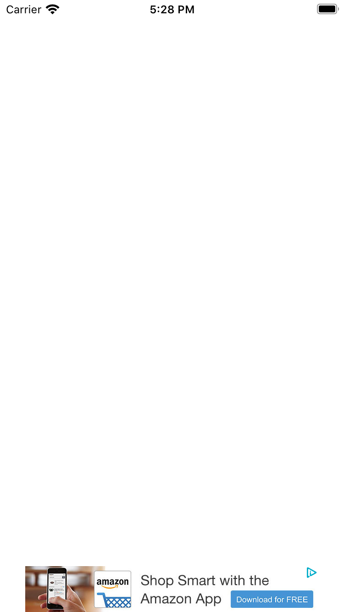

# AdMob APS Sample for iOS

AdMobをAd ServerにしてAPSを動かすサンプルプロジェクト

## Setup

```
$ pod install --repo-update
```

`AdMob-AP-Sample/AppDelegate.swift`の`apsAppID`を自身のAPS AppIDに差し替えてください。

```swift
@UIApplicationMain
class AppDelegate: UIResponder, UIApplicationDelegate {

    // APSのAppIDを入れてください
    let apsAppID: String = "b478e6a7750d4bcc8d4a4e53c04d6fab"

    var window: UIWindow?
    ...
}
```

`AdMob-APS-Sample/ViewController.swift`の以下の値を自身の値に差し替えてください。

```swift

class ViewController: UIViewController {

    // AdMobのバナー（320x50）のAdUnitIDを入れてください
    let adMobAdUnitID = "ca-app-pub-2222899768110117/5645225761"
    // APSのSlotUUIDを入れてください
    let apsSlotUUID = "e0c7923c-4885-4c8d-87dd-57bb637365f7"

    ...
}
```

Build & Runでsimulatorで動かすと以下のようになります

